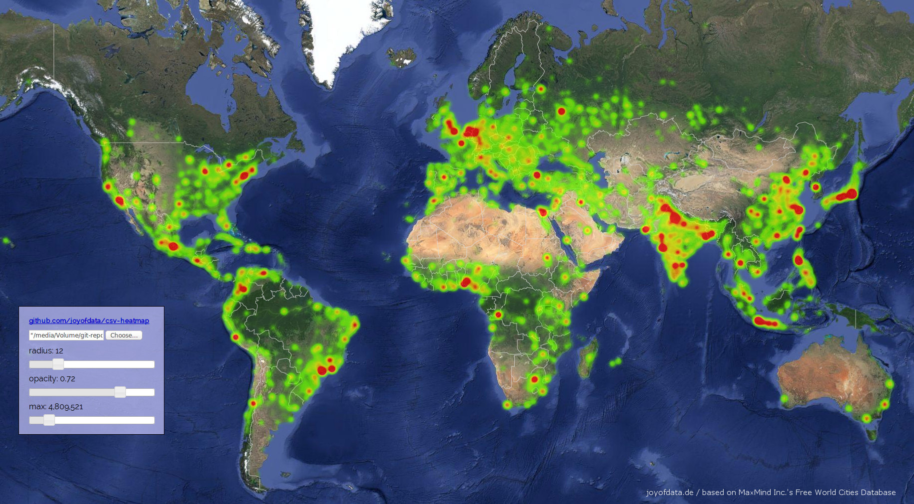

csv-heatmap
===========
[Interactive Heatmaps with Google Maps API v3](http://www.joyofdata.de/blog/interactive-heatmaps-with-google-maps-api/) / [joyofdata.de](http://blog.joyofdata.de) / [Twitter - @joyofdata](https://twitter.com/joyofdata)

---

A description of this little project you may find here:

[www.joyofdata.de/blog/interactive-heatmaps-with-google-maps-api](http://www.joyofdata.de/blog/interactive-heatmaps-with-google-maps-api/)

For some hands on experience check this out: [heatmap.joyofdata.de](http://heatmap.joyofdata.de)
